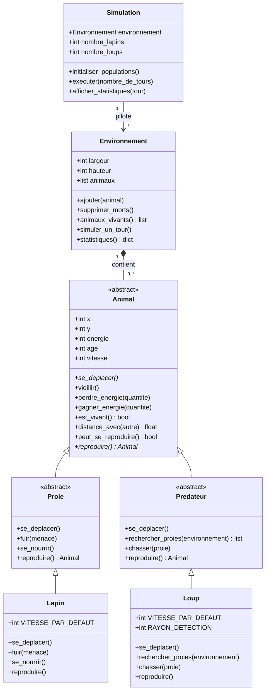

# Diagramme UML

> Diagramme de classes à compléter. Le bloc ci-dessous utilise la syntaxe
> Mermaid (rendu possible sur GitHub et dans de nombreux éditeurs).

## À compléter

- [ ] Vérifier les attributs et méthodes définitifs.
- [ ] Confirmer les multiplicités des relations.
- [ ] Ajouter les contraintes éventuelles (rayon de détection, règles de
      reproduction).
- [ ] Préparer une version exportée en image pour le rendu.
