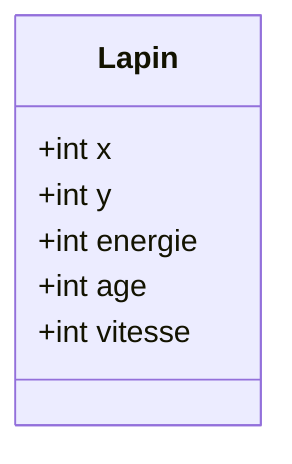

# UML — Exercice 1

```mermaid
classDiagram
    class Lapin {
        +int x
        +int y
        +int energie
        +int age
        +int vitesse
    }
```

À ce stade, l'exercice demande uniquement d'identifier les caractéristiques
d'un lapin. Les méthodes seront ajoutées progressivement dans les exercices
suivants.
