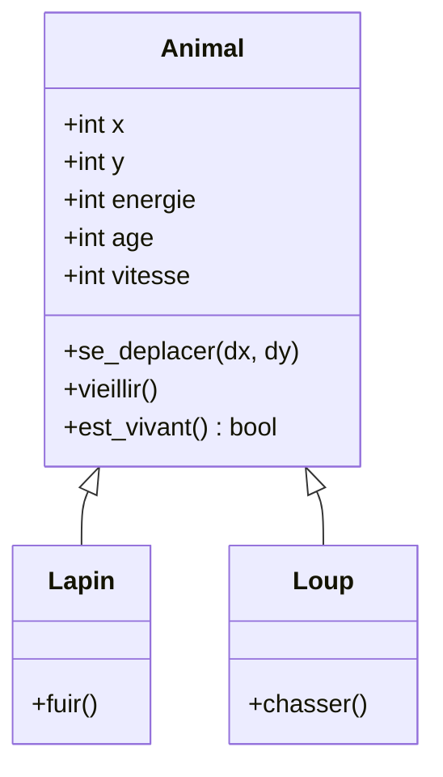

# UML — exercices 1 à 10

```mermaid
classDiagram
    class Animal {
        +int x
        +int y
        +int energie
        +int age
        +int vitesse
        +se_deplacer(dx, dy)
        +vieillir()
        +est_vivant() bool
    }

    class Lapin {
        +fuir()
    }

    class Loup {
        +chasser()
    }

    Animal <|-- Lapin
    Animal <|-- Loup
```
