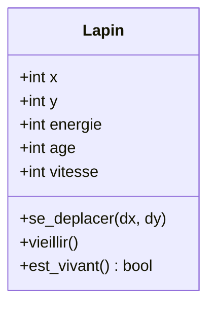

# UML — Exercices 1 à 6

```mermaid
classDiagram
    class Lapin {
        +int x
        +int y
        +int energie
        +int age
        +int vitesse
        +se_deplacer(dx, dy)
        +vieillir()
        +est_vivant() bool
    }
```

Le diagramme reste volontairement simple. L'héritage et les autres classes
seront introduits dans les étapes suivantes du TP.
