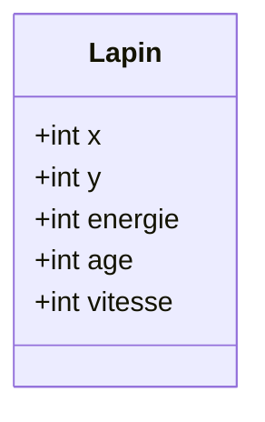
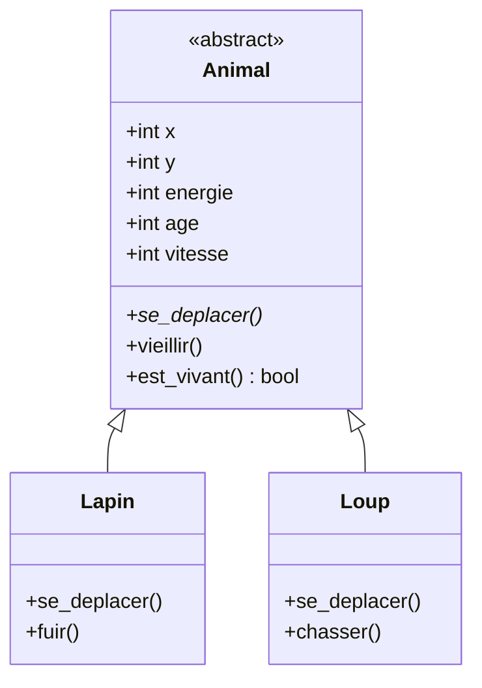
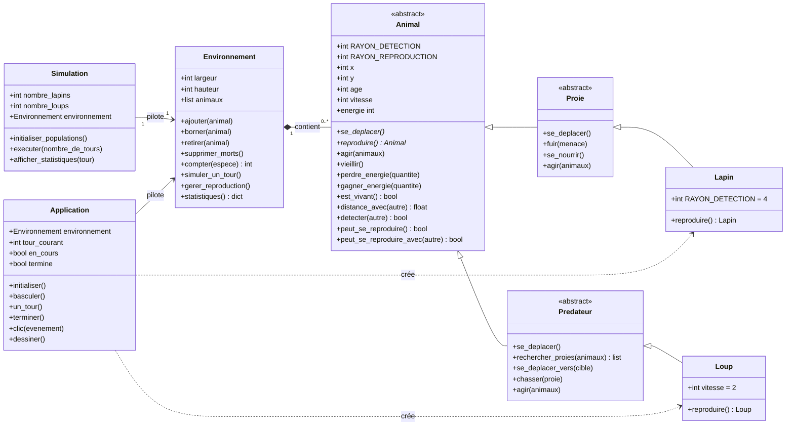

# Simulation d'un écosystème proie-prédateur

Rapport de TP — Programmation orientée objet en Python.

> **Remarque :** ce rapport a été rédigé en parallèle de la réalisation des exercices. Certaines parties ont été modifiées lors des exercices suivants ; il peut donc être incomplet ou ne pas correspondre exactement au code final.

---

## Exercice 1 — Identifier les caractéristiques d'un lapin

### Question 1

> Quels éléments doivent être représentés par des attributs ?

Les attributs sont `x`, `y`, `energie`, `age` et `vitesse`.

### Question 2

> Quelles actions peut réaliser un lapin ? Proposez au moins trois méthodes.

Les méthodes proposées sont `se_deplacer()`, `vieillir()` et `est_vivant()`.

### Question 3

> Représentez votre classe sous forme UML.



## Exercice 6 — Plusieurs objets

> Pourquoi une liste d'objets est-elle plus intéressante ici que cinq variables distinctes ?

Une liste permet de parcourir les lapins avec une boucle et de traiter la population comme un ensemble. Avec cinq variables distinctes, le même code devrait être répété pour chaque lapin.

## Exercice 7 — Identifier la duplication

> Quel concept de POO permet de factoriser ces caractéristiques communes ?

Le concept qui permet de factoriser les caractéristiques communes est l'héritage.

## Exercice 10 — Comportements spécifiques

> Complétez le diagramme UML en ajoutant les principaux attributs et méthodes.

`Animal` est la classe mère. `Lapin` ajoute `fuir()` et `Loup` ajoute `chasser()`.



## Exercice 12 — Polymorphisme

> Pourquoi n'avons-nous pas besoin d'écrire `if isinstance(animal, Lapin)` ? Expliquez avec vos propres mots ce qu'est le polymorphisme.

Chaque animal possède sa propre méthode `se_deplacer()`. En parcourant une liste d'animaux, Python appelle automatiquement la méthode correspondant au type réel de l'objet. Le polymorphisme est donc la capacité d'utiliser une même instruction, par exemple `animal.se_deplacer()`, avec des comportements différents selon la classe de l'objet, sans avoir à tester son type.

## Exercice 14 — Tester l'abstraction

> Essayez `animal = Animal(10, 10)`. Que se passe-t-il ? Expliquez pourquoi.

L'instruction déclenche une erreur :

```text
TypeError: Can't instantiate abstract class Animal with abstract methods reproduire, se_deplacer
```

`Animal` contient des méthodes abstraites (`se_deplacer()` et `reproduire()`), donc la classe est abstraite. Python interdit de créer directement un objet `Animal` : seules les classes concrètes `Lapin` et `Loup`, qui implémentent ces méthodes, peuvent être instanciées.

## Exercice 15 — Encapsuler l'énergie

> Réfléchissez à la manière de garantir que l'énergie ne devienne pas incohérente.

L'énergie est stockée dans un attribut protégé `_energie` et n'est accessible qu'en lecture par la propriété `energie`. Elle ne peut être modifiée que par les méthodes de l'objet. La méthode `perdre_energie()` utilise `max(0, ...)` pour empêcher toute valeur négative. Toute modification directe, comme `lapin.energie = -500`, est refusée :

```text
AttributeError: can't set attribute
```

## Exercice 17 — Distance

> Cette fonctionnalité doit-elle appartenir à `Animal`, à `Environnement` ou à une fonction indépendante ? Justifiez votre choix.

Elle appartient à `Animal`. La distance ne dépend que des positions de deux animaux : la placer dans `Animal` garde les données et le comportement qui les utilise au même endroit, et permet d'écrire `animal.distance_avec(autre)` sans que l'objet ait besoin de connaître l'environnement.

## Exercice 20 — Ajouter des animaux

> Quel concept de POO illustre le fait qu'un environnement contient des animaux ?

La composition. Un `Environnement` possède une collection d'animaux : il en est responsable et les gère (ajout, suppression, évolution) sans hériter d'eux.

## Exercice 23 — Reproduction

> La méthode `reproduire()` doit-elle être définie dans `Animal`, `Proie`, `Lapin` ou une autre classe ? Justifiez votre choix.

La condition de reproduction est commune et se place dans `Animal` via `peut_se_reproduire()` (âge ≥ 5 et énergie ≥ 60). En revanche, la création d'un nouvel individu dépend de l'espèce : `reproduire()` est donc abstraite dans `Animal` et implémentée dans `Lapin` et `Loup`, qui renvoient un objet de leur propre classe.

## Reproduction par couple

> Règle : au moins deux animaux de la même espèce doivent être proches, et la reproduction consomme l'énergie des deux parents.

La règle est répartie sur trois niveaux :

- `Animal` porte les paramètres communs et les conditions : `RAYON_REPRODUCTION`, `peut_se_reproduire()` (âge ≥ 5 et énergie ≥ 60) et `peut_se_reproduire_avec(autre)` (même espèce, les deux prêts, distance ≤ rayon) ;
- `Lapin` et `Loup` fournissent seulement `reproduire()`, qui crée un petit de leur propre espèce ;
- `Environnement` forme les couples : il parcourt les animaux, cherche un partenaire proche et disponible, retire `COUT_REPRODUCTION` à chacun, puis ajoute le petit. Un animal ne participe qu'à un seul couple par tour.

```python
def peut_se_reproduire_avec(self, autre):
    return (
        type(autre) is type(self)
        and self.est_vivant()
        and autre.est_vivant()
        and self.peut_se_reproduire()
        and autre.peut_se_reproduire()
        and self.distance_avec(autre) <= self.RAYON_REPRODUCTION
    )
```

Avec cette règle, un animal isolé ne peut plus se reproduire : il faut un partenaire proche de la même espèce.

## Fuite du lapin

> Logique retenue pour le déplacement de fuite.

Le rayon de détection est défini dans `Animal` (10 par défaut). `Lapin` le redéfinit à 4, soit environ 40 % de celui du loup. Hors de ce rayon, le lapin ne réagit pas et se déplace au hasard.

Dans son rayon de détection, le lapin examine les quatre cases voisines accessibles le long des axes. Il choisit celle qui maximise la distance au carré avec la menace, puis s'y déplace d'une case. Cette règle offre le plus grand gain de distance par case déplacée. Le déplacement diagonal n'est pas utilisé : il coûterait deux cases.

```python
def fuir(self, menace):
    meilleur = None
    meilleure_distance = -1
    for dx, dy in ((1, 0), (-1, 0), (0, 1), (0, -1)):
        distance = (menace.x - (self.x + dx)) ** 2 + (menace.y - (self.y + dy)) ** 2
        if distance > meilleure_distance:
            meilleure_distance = distance
            meilleur = (dx, dy)
    self.x += meilleur[0]
    self.y += meilleur[1]
```

La fuite reste locale : le lapin ne prévoit pas le déplacement du loup. Comme le loup avance de deux cases par tour contre une pour le lapin, il finit par le rattraper en terrain ouvert.

## Exercice final 8 — Diagramme UML

> Réalisez un diagramme UML représentant votre conception.



Le diagramme fait apparaître l'héritage (`Animal` → `Proie` / `Predateur` → `Lapin` / `Loup`), la composition entre `Environnement` et les animaux, ainsi que `Simulation` et `Application` qui pilotent l'environnement. Les classes abstraites sont indiquées par le stéréotype `<<abstract>>`.

## Exercice final 9 — Tests unitaires

> Créez au minimum les tests demandés et lancez-les avec unittest.

- Test 1 — Création : âge = 0 et énergie = 100.
- Test 2 — Vieillissement : après un tour, l'âge augmente et l'énergie diminue.
- Test 3 — Mort : un animal à 0 énergie est mort.
- Test 4 — Déplacement : les coordonnées changent d'une case.
- Test 5 — Chasse : le lapin meurt et le loup gagne de l'énergie.
- Test 6 — Environnement : le nombre d'animaux ajoutés est correct.
- Test 7 — Suppression : un animal mort est retiré.

Les tests sont regroupés dans `test_animal.py` et `test_environnement.py`, puis lancés avec :

```bash
python -m unittest
```

Les huit tests passent.

## Visualisation graphique (tkinter)

> Défi facultatif — créer une interface graphique simple.

Le fichier `visualisation.py` ouvre une fenêtre indépendante qui affiche la grille : un point vert par lapin, un point rouge par loup. Le panneau latéral permet de régler la largeur et la hauteur de la grille, le nombre initial de lapins et de loups, ainsi que l'intervalle entre deux tours. Il permet aussi d'initialiser, démarrer, mettre en pause et avancer d'un tour ; les animaux morts sont retirés automatiquement à la fin de chaque tour. Pour ajouter un animal, on choisit « Lapin » ou « Loup » puis on clique sur la case voulue ; pour en supprimer un, on choisit « Supprimer un animal » puis on clique sur l'animal. Les compteurs (tour, proies, prédateurs, total) sont mis à jour à chaque tour, et la simulation s'arrête automatiquement lorsqu'il ne reste plus aucune proie.

```bash
python visualisation.py
```

---

TP de programmation orientée objet — Python 3
