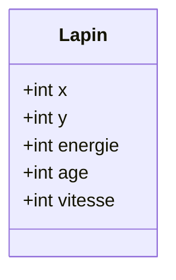
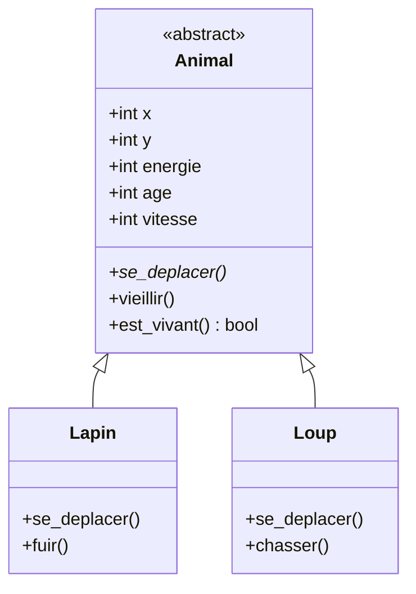

# 中文报告：问题与回答

> 猎物—捕食者生态系统模拟 — 练习 1 至 14

## 练习 1：识别兔子的特征

### 问题 1

> 哪些元素应当表示为属性？

属性为 `x`、`y`、`energie`、`age` 和 `vitesse`。

### 问题 2

> 兔子可以执行哪些动作？请至少提出三个方法。

方法为 `se_deplacer()`、`vieillir()` 和 `est_vivant()`。

### 问题 3

> 用 UML 表示你的类。



## 练习 6：多个对象

### 问题

> 为什么在这里使用对象列表比使用五个独立变量更有意义？

用对象列表可以通过循环遍历所有兔子，并把种群作为一个整体处理；如果用五个独立变量，相同代码就要为每只兔子重复一遍。

## 练习 7：识别重复

### 问题

> 哪种面向对象概念可以对这些共同特征进行因子化？

能够提取共同特征的概念是继承。

## 练习 10：特定行为

### UML 问题

> 补全 UML 图，并添加主要的属性和方法。

`Animal` 是父类。`Lapin` 增加 `fuir()`，`Loup` 增加 `chasser()`。



## 练习 12：多态

### 问题

> 为什么我们不需要写 `if isinstance(animal, Lapin)`？请用你自己的话解释什么是多态。

每个动物都有自己的 `se_deplacer()` 方法。遍历动物列表时，Python 会自动调用与对象实际类型对应的那个方法。因此，多态就是：同一条指令（例如 `animal.se_deplacer()`）根据对象的类产生不同的行为，而不需要判断对象类型。

## 练习 14：测试抽象

### 问题

> 尝试 `animal = Animal(10, 10)`。会发生什么？解释原因。

该语句会报错：

```text
TypeError: Can't instantiate abstract class Animal with abstract method se_deplacer
```

`Animal` 含有抽象方法 `se_deplacer()`，因此它是抽象类。Python 不允许直接创建 `Animal` 对象，只有实现了该方法的 `Lapin` 和 `Loup` 这些具体类才能被实例化。
