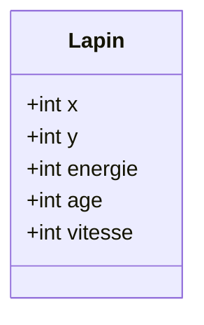
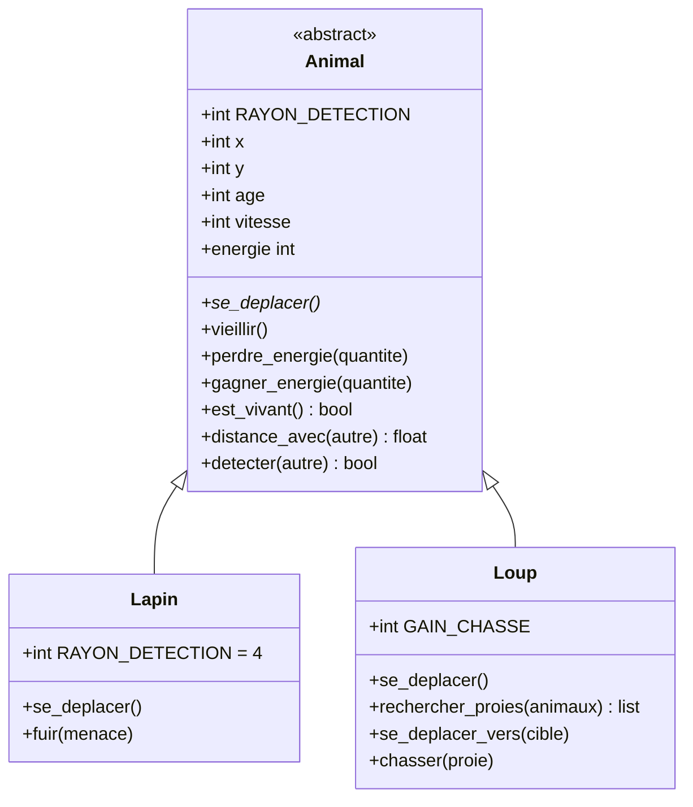

# 中文报告：问题与回答

## 练习 1：识别兔子的特征

### 问题 1

> 哪些元素应当表示为属性？

属性为 `x`、`y`、`energie`、`age` 和 `vitesse`。

### 问题 2

> 兔子可以执行哪些动作？请至少提出三个方法。

方法为 `se_deplacer()`、`vieillir()` 和 `est_vivant()`。

### 问题 3

> 用 UML 表示你的类。



## 练习 6：多个对象

### 问题

> 为什么在这里使用对象列表比使用五个独立变量更有意义？

用对象列表可以通过循环遍历所有兔子，并把种群作为一个整体处理；如果用五个独立变量，相同代码就要为每只兔子重复一遍。

## 练习 7：识别重复

### 问题

> 哪种面向对象概念可以对这些共同特征进行因子化？

能够提取共同特征的概念是继承。

## 练习 10：特定行为

### UML 问题

> 补全 UML 图，并添加主要的属性和方法。

`Animal` 是父类。`Lapin` 增加 `fuir()`，`Loup` 增加 `chasser()`。



## 练习 12：多态

### 问题

> 为什么我们不需要写 `if isinstance(animal, Lapin)`？请用你自己的话解释什么是多态。

每个动物都有自己的 `se_deplacer()` 方法。遍历动物列表时，Python 会自动调用与对象实际类型对应的那个方法。因此，多态就是：同一条指令（例如 `animal.se_deplacer()`）根据对象的类产生不同的行为，而不需要判断对象类型。

## 练习 14：测试抽象

### 问题

> 尝试 `animal = Animal(10, 10)`。会发生什么？解释原因。

该语句会报错：

```text
TypeError: Can't instantiate abstract class Animal with abstract method se_deplacer
```

`Animal` 含有抽象方法 `se_deplacer()`，因此它是抽象类。Python 不允许直接创建 `Animal` 对象，只有实现了该方法的 `Lapin` 和 `Loup` 这些具体类才能被实例化。

## 练习 15：封装能量

### 问题

> 思考如何保证能量不会变得不一致。

能量保存在受保护属性 `_energie` 中，只能通过只读属性 `energie` 读取，并且只能由对象自己的方法修改。`perdre_energie()` 使用 `max(0, ...)`，因此能量不会变成负数。像 `lapin.energie = -500` 这样的直接修改会被拒绝：

```text
AttributeError: can't set attribute
```

## 练习 17：距离

### 设计问题

> 这个功能应当属于 `Animal`、`Environnement`，还是一个独立函数？请论证你的选择。

它属于 `Animal`。距离只取决于两只动物的位置，把它放在 `Animal` 中可以让数据和用到它的行为保持在一起，并且可以直接写 `animal.distance_avec(autre)`，而无需让对象知道环境的存在。

## 兔子的逃跑

### 采用的逃跑逻辑

探测半径定义在 `Animal` 中（默认 10）。`Lapin` 将其覆盖为 4，约为狼的 40%。超出该半径时，兔子不会做出反应，而是随机移动。

在探测范围内，兔子检查沿坐标轴可达的四个相邻格，选择与威胁之间**距离平方最大**的那一格，然后移动 1 格。这样每移动一格获得最大的距离增量。不使用对角移动，因为对角需要消耗 2 格行走量。

```python
def fuir(self, menace):
    meilleur = None
    meilleure_distance = -1
    for dx, dy in ((1, 0), (-1, 0), (0, 1), (0, -1)):
        distance = (menace.x - (self.x + dx)) ** 2 + (menace.y - (self.y + dy)) ** 2
        if distance > meilleure_distance:
            meilleure_distance = distance
            meilleur = (dx, dy)
    self.x += meilleur[0]
    self.y += meilleur[1]
```

逃跑是局部的：兔子不会预判狼的移动。由于狼每回合前进 2 格而兔子只有 1 格，在开阔地形中狼最终仍会追上。
