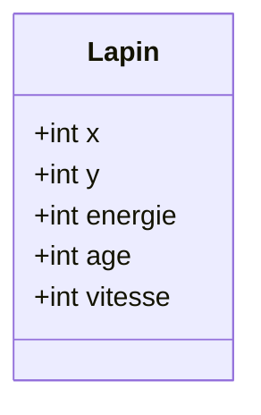
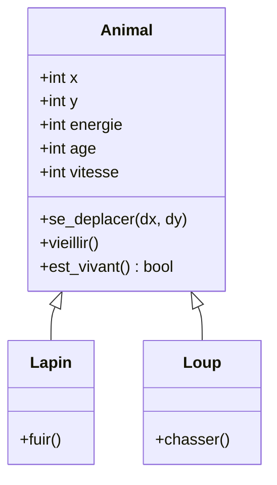

# 中文报告：问题回答

## 练习 1

**问题 1**

属性为 `x`、`y`、`energie`、`age` 和 `vitesse`。

**问题 2**

方法为 `se_deplacer(dx, dy)`、`vieillir()` 和 `est_vivant()`。

**问题 3**

## 练习 6

用对象列表可以通过循环遍历所有兔子，并把种群作为一个整体处理；如果用五个独立变量，相同代码就要为每只兔子重复一遍。

## 练习 7

能够提取共同特征的概念是继承。

## 练习 10

`Animal` 是父类。`Lapin` 增加 `fuir()`，`Loup` 增加 `chasser()`。

