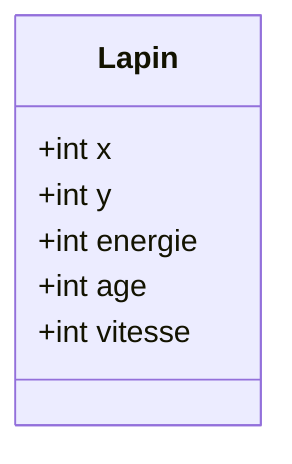
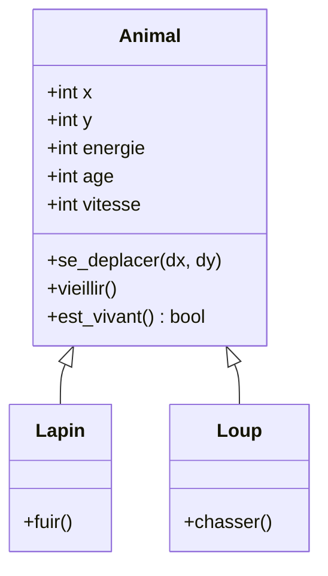

# 中文报告：问题与回答

## 练习 1：识别兔子的特征

### 问题 1

> 哪些元素应当表示为属性？

属性为 `x`、`y`、`energie`、`age` 和 `vitesse`。

### 问题 2

> 兔子可以执行哪些动作？请至少提出三个方法。

方法为 `se_deplacer(dx, dy)`、`vieillir()` 和 `est_vivant()`。

### 问题 3

> 用 UML 表示你的类。

## 练习 6：多个对象

### 问题

> 为什么在这里使用对象列表比使用五个独立变量更有意义？

用对象列表可以通过循环遍历所有兔子，并把种群作为一个整体处理；如果用五个独立变量，相同代码就要为每只兔子重复一遍。

## 练习 7：识别重复

### 问题

> 哪种面向对象概念可以对这些共同特征进行因子化？

能够提取共同特征的概念是继承。

## 练习 10：特定行为

### UML 问题

> 补全 UML 图，并添加主要的属性和方法。

`Animal` 是父类。`Lapin` 增加 `fuir()`，`Loup` 增加 `chasser()`。

